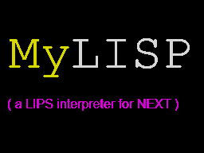
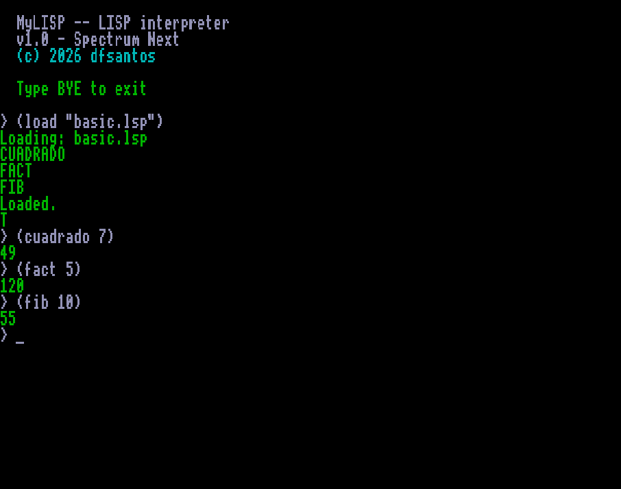

# MyLISP for ZX Spectrum Next (v1.0)

MyLISP is a LISP-1 interpreter for the ZX Spectrum Next, written in C (Z88DK)
under NextZXOS. It is designed as a computer algebra system (CAS) engine:
it prioritizes mathematical exactness over convenience, strict lexical
scoping, and arithmetic safety over concrete types.

It shares its design and philosophy with the original [Sinclair QL version](https://github.com/dfernande132/MyLISP),
with one important structural difference: **the evaluator is iterative, not
recursive** — a user Lisp program's recursion depth does not depend on the
Z80's call stack. Deeply recursive functions (hundreds of levels) run
without exhausting the stack; the practical limit becomes the heap instead.

## 💻 System Requirements & Quick Start

- **Platform:** ZX Spectrum Next, real hardware or emulator (CSpect), running NextZXOS.
- **Memory:** MyLISP takes advantage of the Next's banked RAM to give the
  interpreter a much larger heap than a flat 64KB machine could offer —
  32,000 heap cells, paged in physical 8KB banks outside the main
  `$8000–$FFFF` window.
- Copy `mylisp.next` to your SD card / NextZXOS filesystem and run it from
  the NextZXOS browser.

## 📂 Repository Structure

- `/mylisp.next`: the interpreter executable for NextZXOS.
- `/DOCS`: technical reference manual, in English and Spanish.
- `/EXAMPLES`: a collection of LISP programs to run on the interpreter.
- `/SCREENSHOT`: a screenshot of the interpreter running.

## 🆚 Differences from the Sinclair QL version

| | QL (Pro Pascal) | Next (Z88DK / C) |
|---|---|---|
| Evaluator | Recursive `Eval`/`Apply` | Iterative, explicit paged task stack |
| Heap cells | 24,000 | 32,000 |
| Max distinct symbols | 256 | 200 |
| Max simultaneous strings | 64 | 50 |
| Max symbol name length | 8 chars | 8 chars |
| User recursion depth limit | Bound by CPU call stack | Bound only by heap / task-stack memory |

## 💡 Included Examples

Inside the `/EXAMPLES` folder:

- **`BASIC`**: fundamentals — data types, list manipulation, flow control,
  classic recursive functions (Fibonacci, Factorial), and controlled error
  handling.
- **`SORT`**: Selection Sort via recursive list processing.
- **`DERIVA`**: symbolic differentiation — parses mathematical expressions
  as trees and applies derivation rules plus basic algebraic simplification.
- **`ORDEN`**: higher-order functions `MAP`, `FILTER`, and `REDUCE` built
  from scratch and applied to custom predicates and arithmetic operations.

## 🚀 Usage and Distribution

MyLISP is **Freeware**. You can download, use, and freely distribute the
binary and manuals as long as they remain unmodified.

**Note on source code:** this is a closed-source project. The interpreter's
source code is not published in this repository and is not available for
download.

## 📝 Changelog

- **v1.0 (Initial Release):** Port of MyLISP to the ZX Spectrum Next.
  Rewritten evaluator (iterative, paged task stack) removing the CPU-stack
  recursion limit present on the QL. Full language and builtin set, real
  floating-point arithmetic, automatic paged mark-sweep GC, reference
  manual, and example scripts.

## 📜 License

- MyLISP binary and documentation are Freeware. You may use them for any
  purpose, including commercial projects. Resale, repackaging, or direct
  monetization of the MyLISP software itself is strictly prohibited.
- The scripts in `/EXAMPLES` are in the public domain; use and modify them
  as you see fit.

*Disclaimer: this software was compiled with Z88DK for the ZX Spectrum Next
under NextZXOS.*
